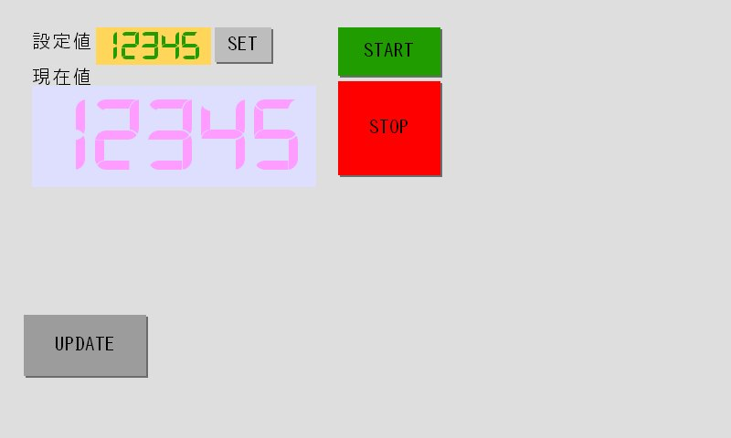

# GOP-CT70A UARTまたはUSBCDC通信にて画面データ書き換えサンプル
raspberry piとGOP-CT70AをUSB接続で通信状態から画面データの書き換えを行うサンプルです。
https://github.com/y-shmada/GOP-CT70A-LinuxHost-Sample  
のサンプルをもとに画面更新機能を付加します。  

## ファイル構成
- update_sample.cpp  
ホストアプリケーションのメインモジュールです。
ここでシリアルポートを初期し、メインループを回します。
- goplt_if.cpp  
GOP-CT70Aのコマンド処理をライブラリ化したモジュールです。(GOP通信ライブラリ)
シリアルでの画面データ更新のため以下APIを追加しています。
 ```C
 BOOL DoTransfarDataSer(char *pathname);
 ```
これらの関数はsample.cで記述しています。
- goplt_if.h  
goplt_if.cppのヘッダーファイルです。  
このファイルをホストアプリケーションのソースで#includeします。

- CMakeLists.txt  
CMake プロジェクトファイルです。
- buildフォルダー  
CMakeビルド作業用フォルダーです
- contents/sample1.etlx  
画面データファイルです。
- contents/update_data.etlx  
更新用の画面データの元ファイルです。このファイルをTP-DesignerLTで開き、書込み用USBメモリーを作成します。  
作成した書き込みデータを次のupdate_dataのフォルダーにコピーしておきます。
- update_data  
更新用画面データファイルです。このフォルダ内の全データをGOPに転送します。  
本サンプルではサンプルを簡潔にするため、USBメモリーから取り出していますが  
直接USBメモリーのフォルダーから転送しても構いません。  


## サンプルアプリケーションの動作
sample1.etlxを開き画面を書き込んでください。
すると以下のような画面となります。  
  

UPDATEボタンを押すと画面更新が始まり成功すると以下のような画面になります。  
  
UPDATEボタンで通信出力を行いこの通信を受けて更新処理を行うようにホストを作ります。

その他の挙動は元のサンプルのままです。  

## ホストソース


### Linux側の準備
- シリアル通信
画面データ書き換えのためにはGOPをリセットする必要があります。  
GOPリセットするとUSBCDC接続の場合挙動が不安定にあるのでポートクローズする関数を用意します。

```C

void Serial_Close()
{
    close(fd);
}
```
### アプリケーションの動作
- メッセージに対するハンドラー  
`DoTransfarDataSer`を呼ぶことで画面データの書き換えが行われます。  
引数は書き換えたいデータがあるフォルダーを指定してください。  
```C
//メッセージ"UPDATE"受信時 画面書き換えを行う
void fnUPDATE()
{
    DoTransfarDataSer("../update_data/");
}


//メッセージ対するハンドラー関数の設定
ltMes_Callback tbl[]={
    {"START",fnSTART},
    {"STOP",fnSTOP},
    {"SET",fnSET},
    {"UPDATE",fnUPDATE},    //更新トリガーの追加
    {NULL,NULL} //ハンドラーテーブルの終端を示すため、最後の行に｛NULL,NULL｝を登録
};
```
- `DoTransfarDataSer`の動作  
この関数は`golt_if.cpp`に記述しています。  
修正・変更の必要はありませんが動作について解説します。  

全体の流れ  
```C
BOOL Serial_Init();
void Serial_Close();
#define ERASE_TIMEOUT 1000000
#define REBOOT_TIMEOUT 10000

BOOL DoTransfarDataSer(char *pathname){
	uint32_t now;
	BOOL ret;
	char cmd_buf[64], * cmd;
	//更新データがあるフォルダを確認し、書き込みデータのリストを作成します。
	MakeFileCatalog(pathname);
	if(filetable==NULL){
		//更新データリストが生成されなければエラー
		return FALSE;
	}
	now	= get_syscount();
	printf("GOP-CTをデータ書き換えモードで再起動します\n");

	send_cmd("REWRITEMODE_SETFLAG");
	now = get_syscount();
	while (!(cmd = gets_lt(cmd_buf, sizeof(cmd_buf), TIMEOUT)));
	if (cmd[0] != 0x06) {
		return FALSE;
	}

	printf("再起動中・・・");
	send_cmd("RESET");
	Serial_Close();//GOPが再起動するため一度ポートを閉じます
	delay(3000);	//再起動待ち
	now = get_syscount();
	//再起動後シリアルポート再接続
	while (!Serial_Init())
	{
		if (get_syscount() > now + REBOOT_TIMEOUT)
		{
			printf("再起動後、ポート再オープンタイムアウト\n");
			return FALSE;
		}
	}
	printf("データ書き換えモードに移行\n");
	send_cmd("DATASTART");
	now = get_syscount();
	while (!(cmd = gets_lt(cmd_buf, sizeof(cmd_buf), TIMEOUT)));
	if (cmd[0] != 0x06) {
		//ack以外でエラー
		return FALSE;
	}
	printf("データ消去中・・・\n");
	send_cmd("DATAERASE");
	now = get_syscount();
	//データ消去は時間がかかるためタイムアウトは長めにします
	while (!(cmd = gets_lt(cmd_buf, sizeof(cmd_buf), ERASE_TIMEOUT)));
	if (cmd[0] != 0x06) {
		return FALSE;
	}
	printf("データ書き込み中・・・\n");
	//更新データリストのファイルをすべて転送します。
	ret=CopyAllSer();
	if (!ret) {
		return FALSE;
	}
	//書き換え処理のクロージングを行います。
	send_cmd("DATAEND");
	now = get_syscount();
	while (!(cmd = gets_lt(cmd_buf, sizeof(cmd_buf), ERASE_TIMEOUT)));
	if (cmd[0] != 0x06) {
		return FALSE;
	}
	printf("データ書き込み完了。再起動します。しばらくお待ちください\n");
	send_cmd("RESET");
	Serial_Close();
	delay(3000);
	now = get_syscount();
	while (!Serial_Init())
	{
		if (get_syscount() > now + REBOOT_TIMEOUT)
		{
			printf("再起動後、ポート再オープンタイムアウト\n");
			return FALSE;
		}
	}
	return TRUE;
}

```

更新データリストの生成  
指定のフォルダ以下のファイルをリスト化します。

```C
struct fileinfo {
	char* src_path;	//ホスト側ファイルシステムが参照可能な名称を指定します
	char* dest_path;	//GOP-LTに書き込み債の名称を指定します。GOP.iniがあるフォルダをルートとし、フォルダ区切りは'/'で指定します。
	int size;				//ファイルサイズを記述。stat等で取得可能であれば実行時取得でも構いません
};
/*
	filetableをクリアします。
*/
struct fileinfo* filetable=NULL;

void clean_table()
{
	if (filetable) {
		struct fileinfo* p = filetable;
		while (p->src_path) 
		{
			free(p->src_path);
			free(p->dest_path);
			p++;
		}
		free(filetable);
		filetable = NULL;
	}
}


/*
	フォルダ中のファイルを検索しfiletable構造体に値をセットします
*/
struct fileinfo* _sub_MakeFileCatalog(char* src_path, char* dest_path,struct fileinfo *p) {
	DIR *dir;
	struct dirent *entry;
	if((dir=opendir(src_path))){
		while((entry=readdir(dir))){
			if (entry->d_name[0] != '.') {
				char spath[1025];
				char dpath[256];
				struct stat info;
				if(dest_path){
					_strcpy(dpath,dest_path);
					_strcat(dpath,"/");
					_strcat(dpath,entry->d_name);
				}else{
					_strcpy(dpath,entry->d_name);
				}
				_strcpy(spath, src_path);
				_strcat(spath, entry->d_name);
				if (!stat(spath, &info) ){
					if (S_ISDIR(info.st_mode)){
						_strcat(spath, "/");
						p=_sub_MakeFileCatalog(spath, dpath,p);
					}else{
						int slen;
						slen = _strlen(spath);
						p->src_path = (char *)malloc(slen+1);
						_strcpy(p->src_path,spath);
						slen = _strlen(dpath);
						p->dest_path = (char *)malloc(slen+1);
						_strcpy(p->dest_path,dpath);
						printf("_sub_MakeFileCatalog %s %s\n",p->src_path,p->dest_path);
						p++;
					}
				}
			}	
		}					
	}
	return p;
}
/*
	フォルダ中のファイル数をを検索します
*/

int _sub_MakeFileCatalog_NUM(char* src_path) {
	DIR *dir;
	int num = 0;
	struct dirent *entry;
	if((dir=opendir(src_path))){
		while((entry=readdir(dir))){
			if (entry->d_name[0] != '.') {
				char spath[1025];
				struct stat info;
				_strcpy(spath, src_path);
				_strcat(spath, entry->d_name);
				printf("%s\n",spath);
				if (!stat(spath, &info) ){
					if (S_ISDIR(info.st_mode)){
						_strcat(spath, "/");
						num+=_sub_MakeFileCatalog_NUM(spath);
					}else{
						num++;
					}
				}
			}						
		}
	}
	return num;
}


void MakeFileCatalog(char *datapath)
{
	if (datapath) {
		struct fileinfo* p;
		int filenum;
		clean_table();
		filenum = _sub_MakeFileCatalog_NUM(datapath);
		filetable = (struct fileinfo*)malloc((filenum + 1) * sizeof(struct fileinfo));
		p = _sub_MakeFileCatalog(datapath, NULL, filetable);
		p->src_path = NULL;
		p->dest_path = NULL;
	}
}

```
全ファイルの送信

```C
BOOL CopyAllSer() 
{
	int i = 0;
	while (TRUE) {
		if (filetable[i].src_path == NULL) {
			break;
		}
		else {
			if (!FileUpload(filetable[i].src_path, filetable[i].dest_path)) {
				return FALSE;
			}
		}
		i++;
	}
	return TRUE;
}
```

ファイル送信  
```C
#define DATASIZE 256
#define PACKSIZE (DATASIZE+8)
#define FASTUPLOAD_TIMEOUT 60000

void debug_binary(int mode);

int FileUpload(char *src,char *dest)
{
	FILE *rf;
	struct _stat sbuf;
	int rlen;
	int size,addr=0;
	char cmd_buf[64], * cmd;
	_stat(src, &sbuf);
	size = sbuf.st_size;
	rf=fopen(src,"r");
	printf("FileUpload %s %s\n",src,dest);
	if(rf){
		uint32_t now;
		unsigned sum;
		int posid = 0;
		//1行目
		sprintf(cmd_buf,"FILEUPLOAD %s %d", dest, size);
		send_cmd(cmd_buf);
		now=get_syscount();
		while (!(cmd = gets_lt(cmd_buf, sizeof(cmd_buf), TIMEOUT)));
		if (cmd[0] != 0x06) {
			goto err;
		}
		//2行以降
		while(1){
			uint8_t rbuf[DATASIZE];
			memset(rbuf,0,DATASIZE);
			int rs = fread(rbuf, 1,DATASIZE,rf);
			if(rs==0)break;
		 	debug_binary(TRUE);
			if (rs != 0) {
				int i;
				uart_putc(0x02);
				uart_putc((uint8_t)((addr >> 0) & 0x000000ff));
				uart_putc((uint8_t)((addr >> 8) & 0x000000ff));
				uart_putc((uint8_t)((addr >> 16) & 0x000000ff));
				uart_putc((uint8_t)((addr >> 24) & 0x000000ff));
				sum = (uint8_t)((addr >> 0) & 0x000000ff) ^ (uint8_t)((addr >> 8) & 0x000000ff) ^ (uint8_t)((addr >> 16) & 0x000000ff) ^ (uint8_t)((addr >> 24) & 0x000000ff);
				for (i = 0; i < DATASIZE; i++) {
					uart_putc( rbuf[i]);
					sum ^= rbuf[i];
				}
				uart_putc(0x03);
				uart_putc(sum);
				uart_putc(0x0d);
				addr += DATASIZE;
			}
		 	debug_binary(FALSE);
			now = get_syscount();
			while (!(cmd = gets_lt(cmd_buf, sizeof(cmd_buf), TIMEOUT)));
			if (cmd[0] != 0x06) {
				goto err;
			}
			if (rs < DATASIZE)break;

		}
		fclose(rf);
	}
	return TRUE;
err:
	fclose(rf);
	return FALSE;

}
```

## ビルド方法
buildフォルダーに移動後  
cmake  
make  
で実行ファイルa.outが作成されます。
```sh
pi@raspberrypi:~/gopct $ cd build
pi@raspberrypi:~/serial-update-sample/build $ cmake ..
-- Configuring done
-- Generating done
-- Build files have been written to: /home/pi/serial-update-sample/build
pi@raspberrypi:~/gopct/build $ make
[100%] Built target a.out
pi@raspberrypi:~/gopct/build $ ./a.out
```